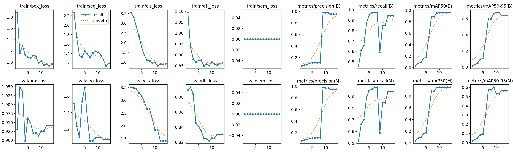
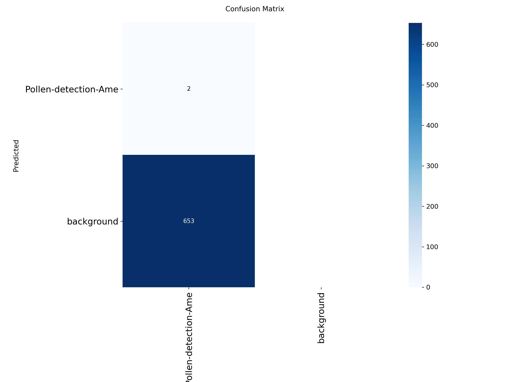
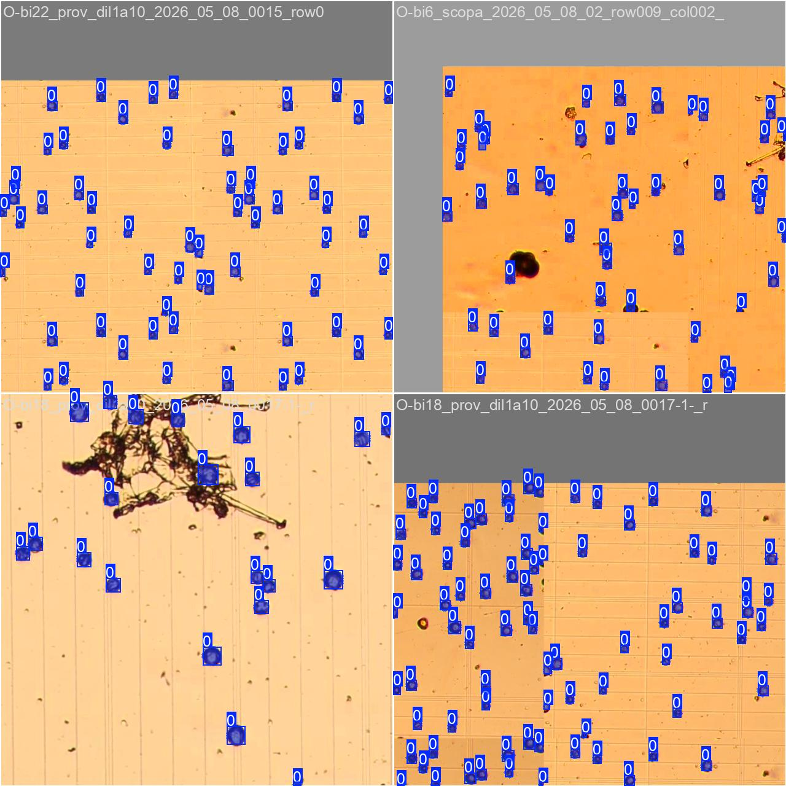
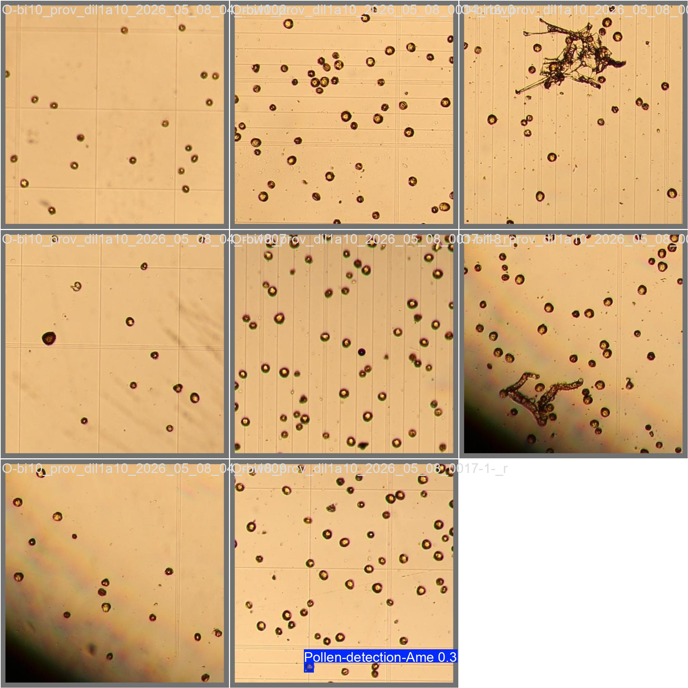

# YOLOv8 Pollen Detection Model Performance

**Last Updated:** 2026-05-10 20:16:10

**Training Images Used:** 19

This page automatically tracks the performance metrics of the latest YOLOv8 Nano instance segmentation training run.

## Model Training Metrics

## Confusion Matrix

## Ground Truth Training Data (What YOLO was taught)

## Validation Predictions (What YOLO guessed)

## Automated Pollen Counting Results

The Bürker grid has been automatically aligned and pollen counted according to the counting protocol.

**📥 [Download Raw Data CSV (pollen_counts.csv)](assets/pollen_counts.csv)**

### visualized_O.bi22_prov_dil1a10_2026_05_08_0015(2).JPG
.JPG)

### visualized_O.bi11_prov_dil1a10_2026_05_08_0014.JPG

### visualized_name_of_your_raw_image.JPG

### visualized_O.bi6_scopa_2026_05_08_02.JPG

### visualized_O.bi10_prov_dil1a10_2026_05_08_04_grid.JPG

### visualized_O.bi10_prov_dil1a10_2026_05_08_04.JPG

### visualized_O.bi22_prov_dil1a10_2026_05_08_0015.JPG

### visualized_O.bi18_prov_dil1a10_2026_05_08_0017(1).JPG
.JPG)

### visualized_O.bi24_prov_dil1a10_2026_05_08_0016(1).JPG
.JPG)

### visualized_O.bi22_prov_dil1a10_2026_05_08_0015(1).JPG
.JPG)

### visualized_O.bi18_prov_dil1a10_2026_05_08_0017.JPG

### visualized_O.bi24_prov_dil1a10_2026_05_08_0016.JPG

